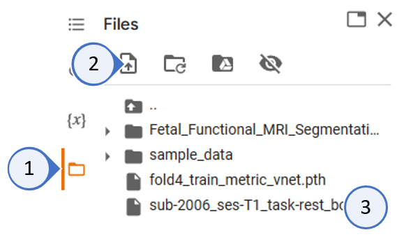
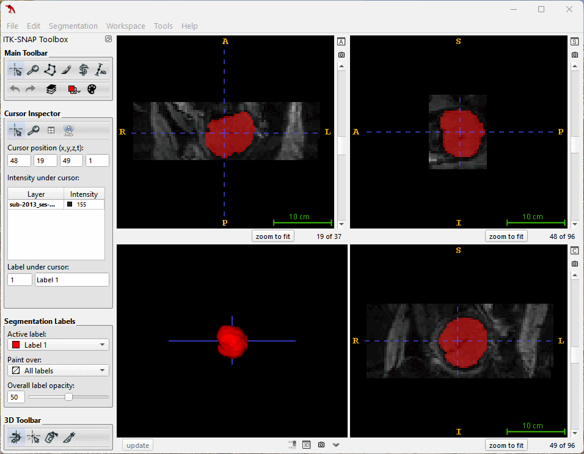

# RUSHRadiologyResearch
Repository for RUSH Radiology Research
# Fetal_Functional_MRI_Segmentation
Automated Brain Masking of Fetal Functional MRI with Open Data

Fetal_Functional_MRI_Segmentation is an open-source toolkit based on MONAI for brain extraction from fetal's function MRI files.

This program can be directly run in Google's Colaboratory

, allowing you to execute fetal brain segmentation code in your browser and:

  - no configuration required
  - only need to upload the fMRI file
  - the mask can be downloaded directly

----

  - Run the program in Colab
  - Click the **Files** icon on the left
  - Click the **Upload to session storage** icon above
  - After uploading the fMRI files press the **Enter** key to continue
  - Rightclick to download results after a short wait
  - Don't forget to **refresh** the output file list

----

